# Aoide

Ἀοιδή, the muse of song. A native Android music player in the shape of Spotify with the polish of Apple Music, painted orange, on top of the [Monochrome](https://monochrome.tf) catalogue.

**Download:** the latest APK is on the [Releases](https://github.com/retrocodes12/aoide/releases) page. Android 8.0 or newer, no account, no sign-up. A web preview of the same design runs at https://retrocodes12.github.io/aoide/ (phone-sized; open it on a phone or shrink the window).

<p>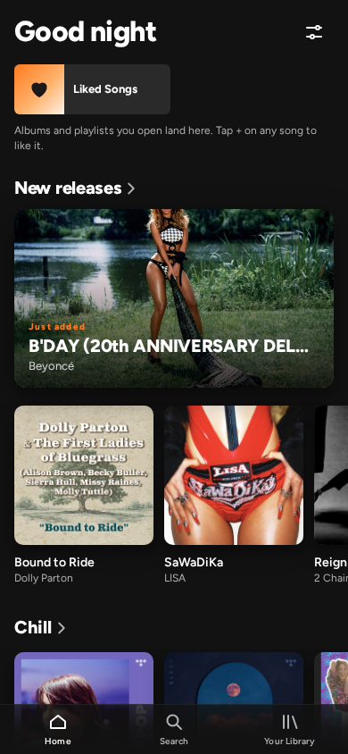 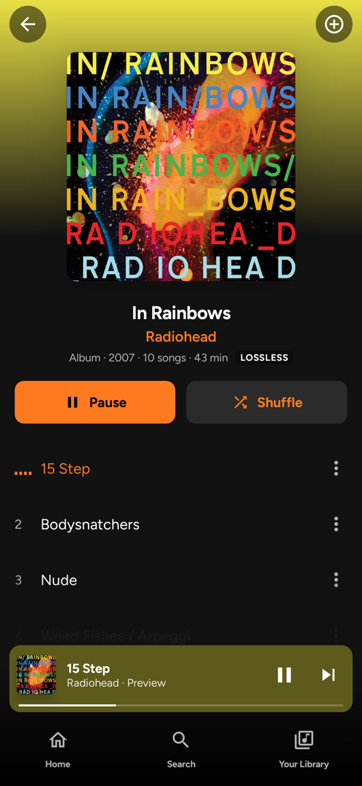 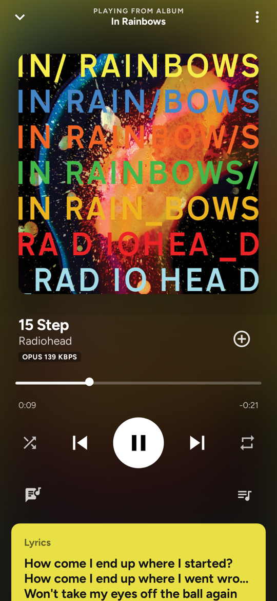 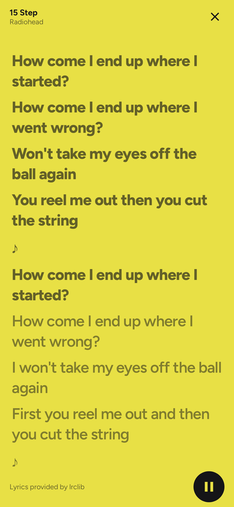</p>
<p>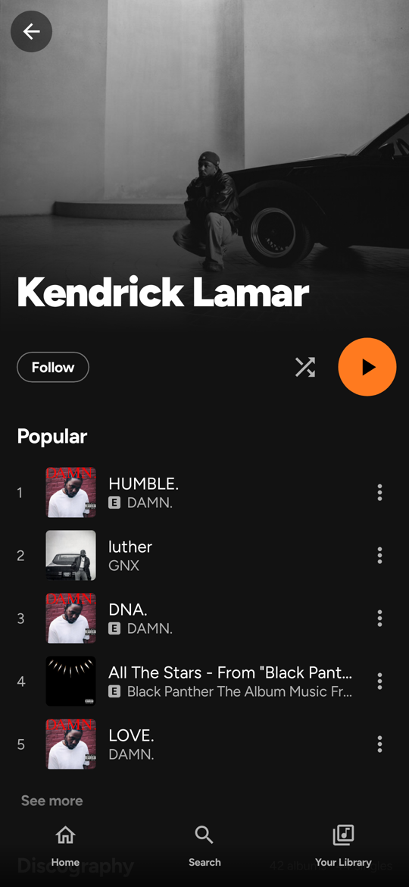 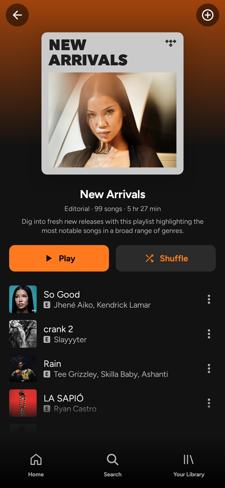 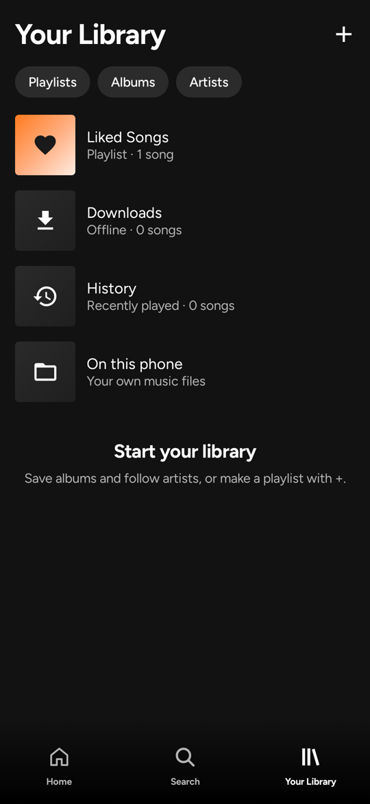 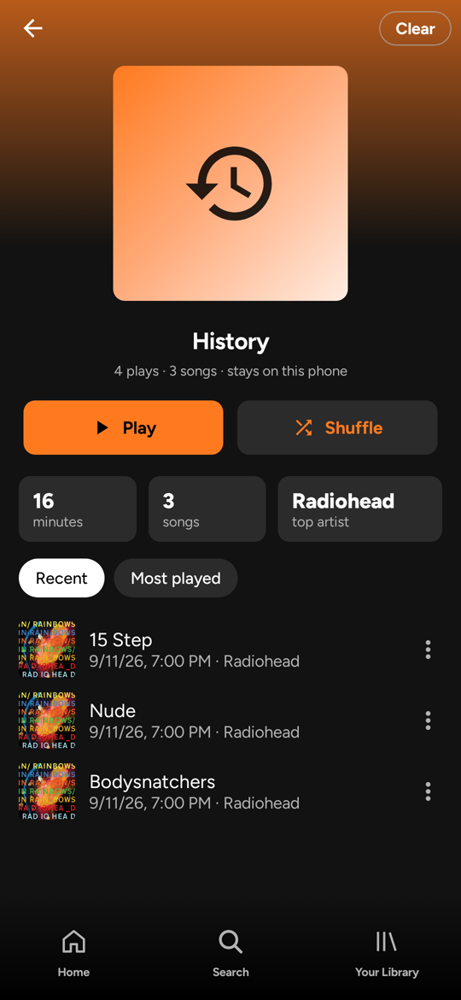</p>
<p>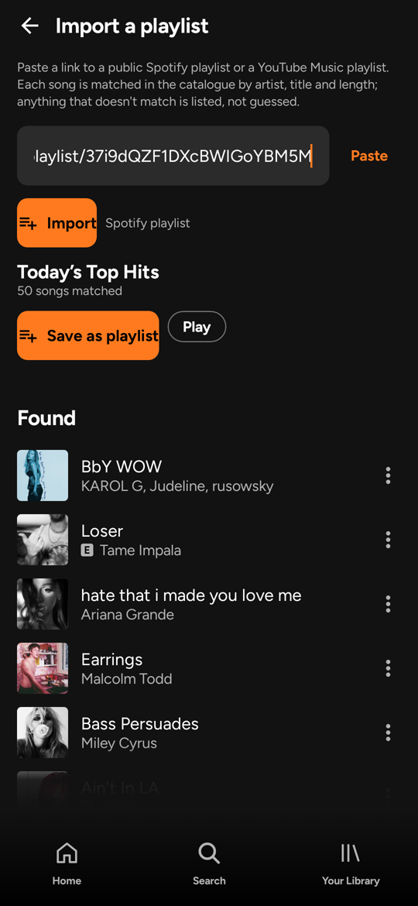 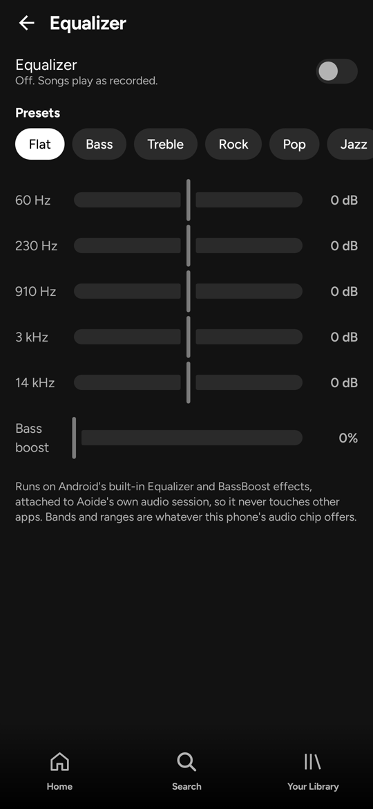 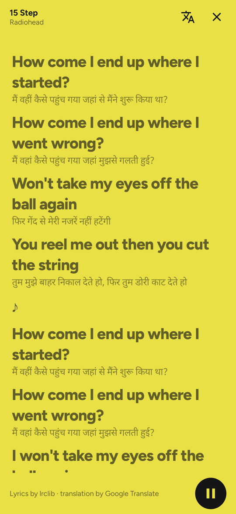 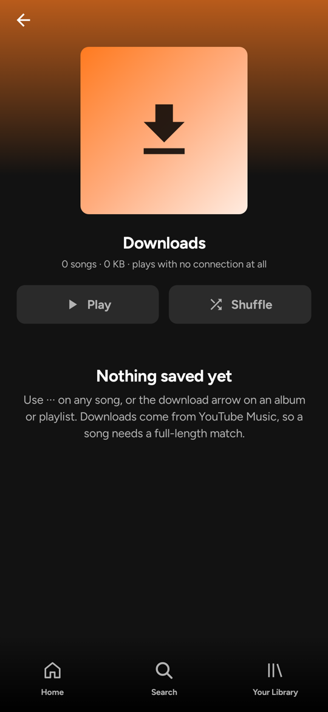</p>

## What it does

- Full songs from YouTube Music, matched to TIDAL's catalogue by artist, title and length, with 30-second previews only when no match exists.
- Home with your quick grid, a hero card for the newest record, new releases, "more like" rows seeded from what you played, and mood rows.
- Search across songs, albums, artists and playlists, with a top result, filter chips, recent searches and a browse grid.
- Album, artist and playlist pages whose heads take the record's colour. The ink on every tint is chosen by measured contrast, so a yellow record gets dark ink and a navy one gets light, and both clear WCAG AA.
- Background playback through Media3: notification, lock screen and headset controls, audio focus, "becoming noisy" pause.
- Queue: play next, add to queue, drag to reorder, remove, jump, clear (with a confirmation). Shuffle that restores the original order when turned off. Repeat one and all.
- Synced lyrics from [lrclib](https://lrclib.net); tap a line to seek. On a preview, lines past the clip are shown for reading and cannot be tapped.
- A full-screen player with the artwork blurred behind everything, the cover shrinking on pause, a hairline seek bar, and a pull-down to dismiss.
- Liked songs, saved albums, followed artists, your own playlists, recently played, recent searches. Everything stays on the phone; nothing leaves it.
- The last queue comes back after a relaunch, paused where it was.
- Plain-language playback errors with a retry. Three dead songs in a row stop the skipping instead of running the queue out.
- Instance manager: reads the same hifi-api mirrors Monochrome lists, fails over between them, benches a broken one for 90 seconds, and lets you add your own. When every mirror is down it browses TIDAL's catalogue directly and says so on Home and in Settings.
- Quality picker: Hi-Res Lossless, Lossless, High, Low, with an honest read-back when a song was only granted a lower tier.

### Added in 0.5.0

- **Downloads.** Any song, album or playlist can be kept on the phone. Files come from YouTube Music (the only source that hands out whole files), are fetched one at a time by a foreground service with a progress notification, and play with no connection at all through the same DASH path as everything else. A Downloads collection in Your Library lists what is kept, what is coming and what failed, with the total size and a remove-all.
- **Your own music files.** "On this phone" reads MediaStore and plays what is already there, with the same rows, queue and player.
- **Import playlists from Spotify and YouTube Music** by pasting a link. Nothing to log into: a public Spotify playlist's embed page and a YouTube Music playlist's browse call both carry the track list. Each song is matched in the catalogue by artist, title and length; misses are listed, never guessed. An imported playlist remembers its source and has a sync button that appends what is new.
- **History and stats.** Recently played and most played, with minutes listened, songs and top artist, all kept on the phone. Clearable.
- **Equalizer.** Five bands (or whatever the phone's audio chip offers), presets, and bass boost, on Android's own audio effects bound to Aoide's audio session.
- **Sleep timer**, in minutes or at the end of the current song, from the player and from any song's menu.
- **Playback settings.** Data saver (the smallest stream on mobile data), fade between songs (the end of one fades out and the next fades in; play and pause fade too; it is a fade, not a true overlap), playback speed with the pitch kept, skip silence, pause when muted, resume when headphones or Bluetooth come back, and autoplay of similar songs when the queue runs out.
- **Share** a song as text with a song.link page, so it opens in whatever the other person uses. **Set as ringtone** for a downloaded song, on Android 10 and newer.
- **Lyrics translated** under each line, through Google Translate's web endpoint, in twenty languages; three lyric sizes.
- **Accent colour** (orange stays the default) and **pure black** for OLED screens.
- **Backup and restore** the library as one JSON file through the system file picker.
- **Android Auto**: the playback service is a Media3 library service, so the car screen can browse Liked Songs, Recently played, Downloads and playlists and search the catalogue by voice.
- **Home-screen widget** with the song playing and play, pause and skip.

Not built, on purpose: Listen Together, Chromecast and DLNA, music recognition, podcasts, canvas videos, video mode, a Dynamic Island, and word-by-word lyrics. Each is either a service Aoide does not have, or a screen it would be dishonest to fake.

## How streaming works, honestly

Aoide browses TIDAL's catalogue through the Monochrome mirrors and plays each song from the best source that answers, in this order:

1. **A mirror of your own**, if you have added one under Settings, Instances. A mirror backed by a subscribed account serves lossless FLAC in full.
2. **YouTube Music**, for the full song. Aoide searches YouTube Music's songs for the same artist and title, accepts only a recording within a few seconds of TIDAL's length, and asks YouTube's player API for its audio while identifying as one of YouTube's own apps. Today that is the Apple Vision Pro client, the one that hands out whole files. The stream is Opus at up to about 160 kbps, not lossless, and the player's badge says so. Every stream's last bytes are read before it plays, because some clients' links stop at about a minute.
3. **The public mirrors and TIDAL's own manifest endpoint**, which serve 30-second previews, labelled PREVIEW in the player.

The YouTube source can be switched off in Settings. It is unofficial and YouTube can change the rules at any time, so the list of clients to pose as lives in [`config/yt-clients.json`](config/yt-clients.json) and the app refreshes it from this repository, which means a broken client can be swapped without a new APK. Aoide only uses streams YouTube hands out as plain links: it does not decode YouTube's signature cipher or run its BotGuard challenge, and it does not touch Monochrome's Turnstile-gated "Unified Playback" service.

## Build

```bash
git clone https://github.com/retrocodes12/aoide
cd aoide
echo "sdk.dir=$HOME/Android/Sdk" > local.properties
JAVA_HOME=/path/to/jdk-17 ./gradlew assembleDebug
```

Release builds are signed with a dedicated key so every build installs over the last one (`app/build.gradle.kts` reads it from `~/.aoide/release.jks` locally and from a secret in CI).

### Screenshots without an emulator

Every screen renders on the JVM through Robolectric's native graphics and Roborazzi, against the live catalogue:

```bash
JAVA_HOME=/path/to/jdk-21 ./gradlew :app:recordRoborazziDebug --tests app.aoide.Shots
```

PNGs land in `app/build/shots/`. This is how the app was audited on a laptop that cannot run the emulator. Two things the rig needs, both in `app/src/test/java/app/aoide/Shots.kt`: the native runtime is warmed up on the test thread before any image decodes, and artwork decodes on the main thread.

### Web preview

The `web/` directory holds the React version of the same design, deployed to GitHub Pages. It shares the catalogue layer's behaviour (mirror failover, TIDAL fallback, lyrics) and served as the audit ground before the native port.

```bash
cd web && npm ci && npm run dev
```

## Design notes

Spotify's structure: three tabs, a capsule mini player, a bottom-sheet track menu, chips, the browse grid. Apple Music's polish: centred artwork heads with paired Play and Shuffle pills, icon discs over artwork, the blurred now-playing stage, lossless badges, Figtree throughout. Dark `#121212`, accent `#ff7a1f`. No orange ever sits on a tint; the tint's ink is solved for contrast in `app/src/main/java/app/aoide/ui/theme/Tint.kt`.

## Disclaimer

Aoide is an independent project. It is not affiliated with Spotify, Apple, TIDAL, YouTube or Monochrome. It plays what the mirrors you configure and YouTube Music return. YouTube's terms of service do not allow third-party apps to stream its audio this way; respect the terms of the services you use.
